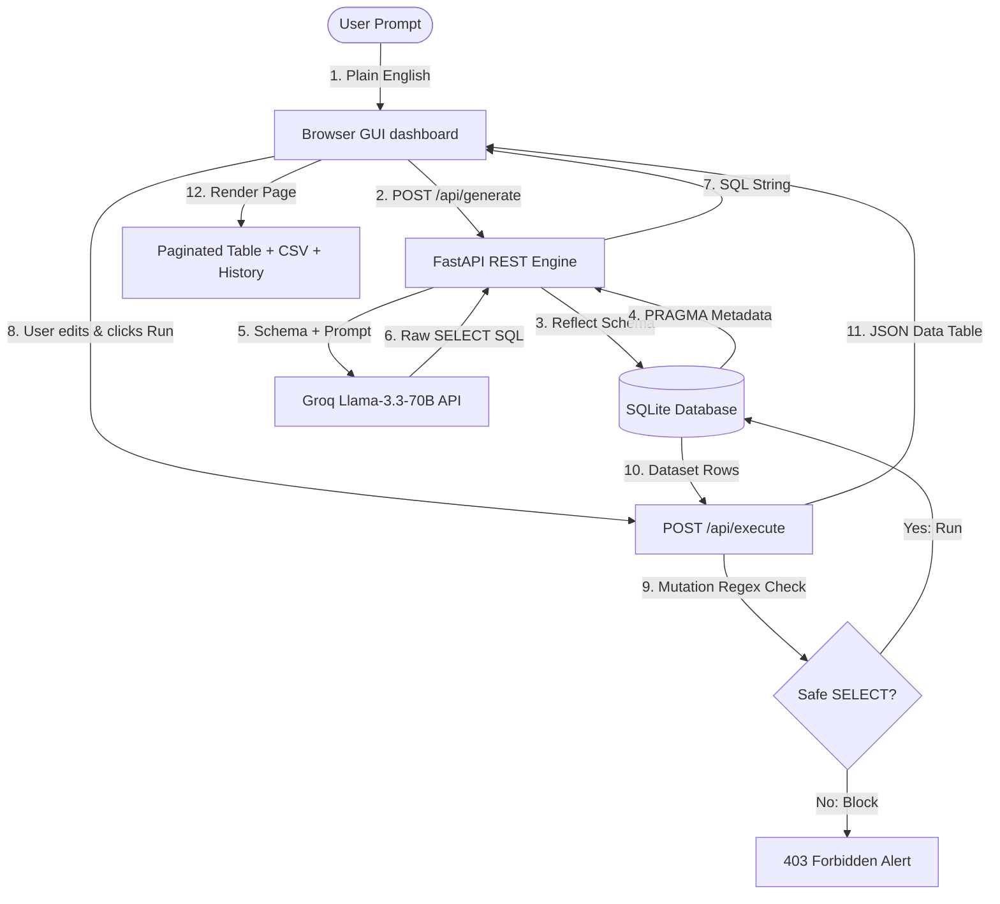

# 🧠 TalkToSQL Engine: Natural Language to SQL Engine

**TalkToSQL Engine** is a high-performance, single-page web workspace that translates conversational English queries into secure, executable SQLite syntax in real-time, displays the output for interactive editing, executes queries on a live database, and visualizes result sets dynamically.

---

## 🗺️ System Architecture & Data Flow



---

## 🚀 How to Run Locally

### 1. **Setup Database & Seeding**
Initialize the database structure and populate it with **170+ rows of realistic transaction data**:
```powershell
python backend/seed.py
```
*This instantly generates `ecommerce.db` in your root folder.*

### 2. **Install Server Dependencies**
Install FastAPI, Uvicorn, Groq, and environment helper modules:
```powershell
pip install -r backend/requirements.txt
```

### 3. **Launch the FastAPI Server**
Start the application server:
```powershell
python -m uvicorn main:app --host 127.0.0.1 --port 8000
```

### 4. **Access the Dashboard**
Open your web browser and navigate directly to:
👉 **[http://127.0.0.1:8000/](http://127.0.0.1:8000/)**

---

## 📅 End-to-End Execution Plan (Phase-wise)

```
┌────────────────────────────────────────────────────────┐
│  Phase 1: DB setup & Seeding (Users, Products, Orders)   │
└───────────────────────────┬────────────────────────────┘
                            ▼
┌────────────────────────────────────────────────────────┐
│  Phase 2: FastAPI Routing & Dynamic LLM Prompting       │
└───────────────────────────┬────────────────────────────┘
                            ▼
┌────────────────────────────────────────────────────────┐
│  Phase 3: GUI Front-End Dashboard (Unified workspace)   │
└───────────────────────────┬────────────────────────────┘
                            ▼
┌────────────────────────────────────────────────────────┐
│  Phase 4: Security Rules, Error Catches, & CSV Export   │
└────────────────────────────────────────────────────────┘
```

### 📦 **Phase 1: Database Foundation**
* **Schema Blueprint**: Designed a robust relational database with keys and indices:
  * `users`: ID, Name, Email, City, Creation date.
  * `products`: ID, Name, Category, Price, Stock inventory level.
  * `orders`: ID, User_ID (FK), Product_ID (FK), Order_date, Quantity, Total_Amount.
* **Deterministic Seeder**: Created `seed.py` to insert **60 users**, **60 products**, and **80 transactional orders** with logical constraints (e.g. `total_amount = price * quantity`).

### ⚙️ **Phase 2: Backend REST Server**
* **FastAPI Setup**: Built endpoint bindings to handle requests asynchronously.
* **Metadata Schema Reflector**: Dynamically reads table listings using `sqlite_master` catalog queries so the LLM prompt remains updated.
* **LLM Translator Hook**: Integrates the Groq API key with `llama-3.3-70b-versatile` running at low temperature (`0.1`) to ensure stable, context-aware SQL outputs.

### 🎨 **Phase 3: Responsive Interface UI**
* **Modern Style Palette**: Implemented glassmorphism layout, modern typography (Outfit + Inter), and a full dark theme.
* **Interactive Panels**:
  * **Left Sidebar**: Renders a dynamic tree structure of tables and columns (allowing **double-click to insert** names directly) alongside the session history log.
  * **Main Canvas**: Split-panel workflow guiding the user from prompt input, to editable SQL editor, to paginated table results.

### 🛡️ **Phase 4: Safeguards & CSV Export**
* **Read-only Enforcement**: Inspects queries at both API and code helper levels, blocking `DELETE`, `UPDATE`, `INSERT`, `DROP`, or `ALTER` requests.
* **Troubleshooting Wrapper**: Catches database-level exception codes and translates them to human-readable hints.
* **CSV Downloader**: Built an in-browser helper to convert table matrices into structured CSV sheets instantly.

---

## ⚖️ Core Design Decisions & Trade-offs

| Choice | Selected Path | Alternative Considered | Trade-off Rationale |
|---|---|---|---|
| **Database Engine** | **SQLite** (Local file) | PostgreSQL / MySQL | **Pros**: Zero dependencies, instant setup, file-based portability.<br>**Cons**: Lower concurrent write volume (not an issue for read-only analytics). |
| **Frontend Framework** | **Vanilla HTML5/JS** | React / Next.js / Vue | **Pros**: Zero compilation time, ultra-fast load speed, single-file delivery.<br>**Cons**: Manual state updates (mitigated by structured state arrays). |
| **AI Inference** | **Groq SDK** (Llama-3.3) | OpenAI GPT-4 / Gemini | **Pros**: Sub-500ms response times, high context window, cost-free testing.<br>**Cons**: Slight formatting drift if temperature settings aren't strictly controlled. |
| **Validation Layer** | **Regex & Prefix Check** | Full SQL AST Parser | **Pros**: Zero-overhead verification, simple codebase maintenance.<br>**Cons**: Can flag columns containing restricted sub-strings (e.g., column named `inserted_at` if not properly bounded). |

---

## ⚡ Query Speed & Caching Blueprint (Bonus Marks)

### **The Mechanism**
To achieve optimal response times, we propose a two-tiered caching system:
1. **LRU Results Cache**: Map standard SQL hashes to their execution row outputs using a standard Least Recently Used (`functools.lru_cache` or Redis) schema. Repeated identical queries hit the cache in **<1ms**.
2. **Semantic Vector Cache**: Generate and store vector embeddings for user prompts. If a new prompt achieves a high cosine similarity (>0.92) with a previous query (e.g., *"list all users"* vs *"show all customers"*), the system bypasses LLM inference entirely and re-runs the cached SQL query.

### **The Trade-offs**
* **Staleness**: Cache outputs can quickly drift if records are modified. We implement a short Time-to-Live (TTL) of **30 seconds** and automatic invalidation upon database write alerts.
* **RAM Footprint**: Storing large tables in memory raises memory costs. We limit cache sizing parameters (e.g., maximum of **200 entries**) and apply eviction rules.
