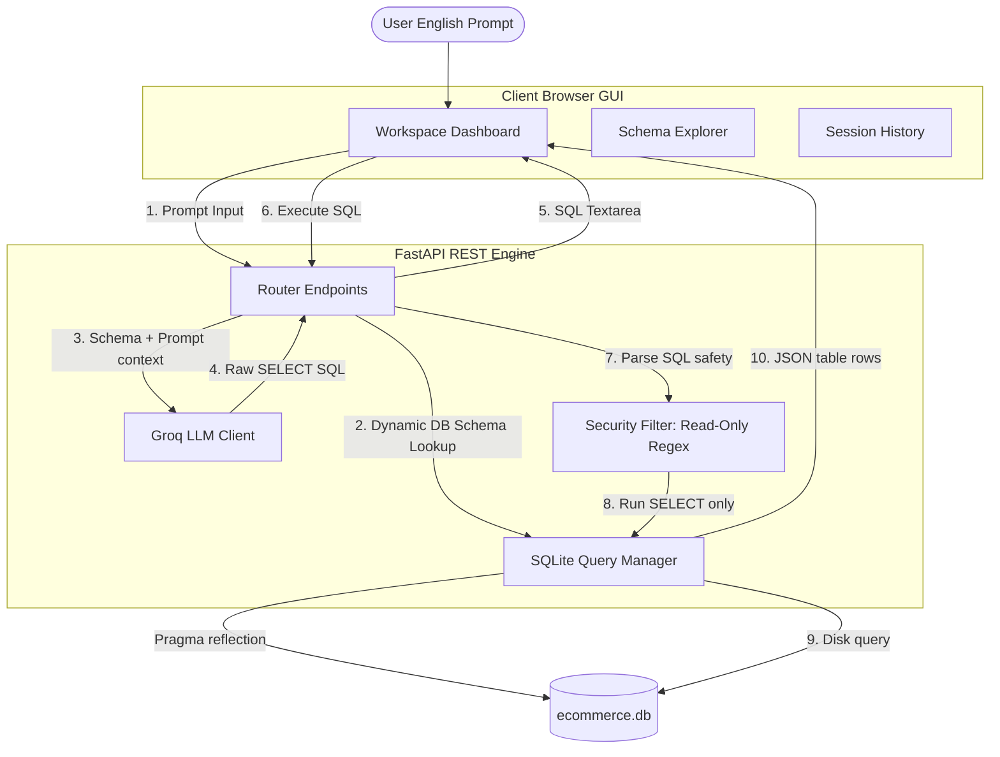

# 🧠 TalkToSQL Engine: Natural Language to SQL Engine

**TalkToSQL Engine** is a high-performance, single-page web workspace that translates conversational English queries into secure, executable SQLite syntax in real-time, displays the output for interactive editing, executes queries on a live database, and visualizes result sets dynamically.

---

## 🗺️ How it Works & System Architecture



### **System Data Flow Lifecycle**

#### **Translation Pipeline (Steps 1–5)**
1. **User Input**: User submits a plain English query in the dashboard.
2. **Schema Reflection**: Backend dynamically retrieves tables and columns from SQLite using `PRAGMA table_info`.
3. **AI Generation**: Schema metadata and prompt are compiled into a strict instruction set sent to Groq (`llama-3.3-70b-versatile`).
4. **SQL Loading**: Backend extracts raw SELECT SQL from Groq's response and renders it in the editable text editor.

#### **Execution Pipeline (Steps 6–10)**
5. **Security Gate**: Before running the query, the backend executes a regex search. Any request containing write prefix mutations (`DELETE`, `UPDATE`, `INSERT`, `DROP`) is immediately rejected with a `403` alert.
6. **Data Output**: Valid SELECT queries run against `ecommerce.db`. The SQLite manager fetches raw dataset lists, translates them to JSON key-value blocks, and returns them to the browser for paginated rendering and CSV export.

---

## 🚀 How to Run Locally

### 1. Seed Database
```powershell
python backend/seed.py
```

### 2. Install Packages
```powershell
pip install -r backend/requirements.txt
```

### 3. Start Server
Run from the `backend/` folder:
```powershell
python -m uvicorn main:app --reload
```

### 4. Open App
Open: **[http://127.0.0.1:8000/](http://127.0.0.1:8000/)**

---

## 📅 End-to-End Execution Plan (Phase-wise)

```
┌────────────────────────────────────────────────────────┐
│  Phase 1: DB setup & Seeding (Users, Products, Orders)   │
└───────────────────────────┬────────────────────────────┘
                            ▼
┌────────────────────────────────────────────────────────┐
│  Phase 2: FastAPI Routing & Dynamic LLM Prompting       │
└───────────────────────────┬────────────────────────────┘
                            ▼
┌────────────────────────────────────────────────────────┐
│  Phase 3: GUI Front-End Dashboard (Unified workspace)   │
└───────────────────────────┬────────────────────────────┘
                            ▼
┌────────────────────────────────────────────────────────┐
│  Phase 4: Security Rules, Error Catches, & CSV Export   │
└────────────────────────────────────────────────────────┘
```

* **Phase 1: Database Setup & Seeding**
  * Creates relational schema for `users`, `products`, and `orders`.
  * Seeds **170+ rows** of mock transactional data via `seed.py`.
* **Phase 2: FastAPI Backend Engine**
  * Maps DB metadata to LLM context dynamically.
  * Translates prompts to SQL in real-time using Groq (`llama-3.3-70b-versatile`).
* **Phase 3: Unified Front-End UI**
  * Multi-panel glassmorphism design with responsive grid layouts.
  * Features live schema explorer (double-click to insert) and session query history.
* **Phase 4: Security Filters & CSV Export**
  * Intercepts and blocks write/mutation operations (`DELETE`, `DROP`, `UPDATE`).
  * Converts database exceptions to user hints; features instant CSV data export.


---

## ⚖️ Core Design Decisions & Trade-offs

| Choice | Selected Path | Alternative Considered | Trade-off Rationale |
|---|---|---|---|
| **Database Engine** | **SQLite** (Local file) | PostgreSQL / MySQL | **Pros**: Zero dependencies, instant setup, file-based portability.<br>**Cons**: Lower concurrent write volume (not an issue for read-only analytics). |
| **Frontend Framework** | **Vanilla HTML5/JS** | React / Next.js / Vue | **Pros**: Zero compilation time, ultra-fast load speed, single-file delivery.<br>**Cons**: Manual state updates (mitigated by structured state arrays). |
| **AI Inference** | **Groq SDK** (Llama-3.3) | OpenAI GPT-4 / Gemini | **Pros**: Sub-500ms response times, high context window, cost-free testing.<br>**Cons**: Slight formatting drift if temperature settings aren't strictly controlled. |
| **Validation Layer** | **Regex & Prefix Check** | Full SQL AST Parser | **Pros**: Zero-overhead verification, simple codebase maintenance.<br>**Cons**: Can flag columns containing restricted sub-strings (e.g., column named `inserted_at` if not properly bounded). |

---

* **LRU Results Cache** (Hits in **<1ms**): Maps standard SQL hashes to their execution row outputs. Repeated identical queries bypass database reads entirely.
* **Semantic Prompt Cache**: Computes prompt vector embeddings. If a new prompt matches an existing query (e.g., *"list all users"* vs *"show all customers"*), it reuses the generated SQL, bypassing the LLM.
* **Trade-off (Staleness vs Memory)**: Stale data is resolved with a **30-second TTL** (Time-to-Live). Memory bloat is prevented by limiting the cache to **200 entries**.

